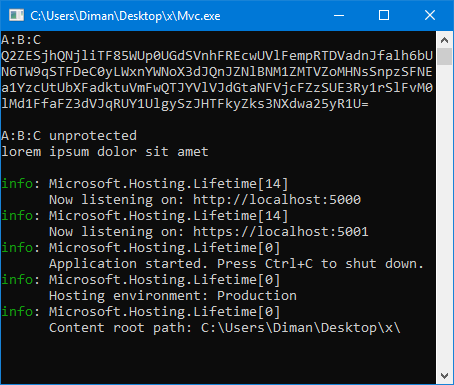

# Neomaster.JsonEncryptor

A library that encrypts and decrypts the values of a json file (appsettings.json).

**Encryption**

`string` &rarr; `cipher` &rarr; `base64`

## Install
```powershell
dotnet add package Neomaster.JsonEncryptor
```

## Example

**appsettings.json** (before)

```json
{
  "A": {
    "B": {
      "C": "lorem ipsum dolor sit amet"
    }
  }
}
```

**Program.cs**

```csharp
using Neomaster;

JsonEncryptor.Instance.Init("lorem ipsum", "appsettings.json");
JsonEncryptor.Instance.SaveAsProtected("A:B:C");

var builder = WebApplication.CreateBuilder(args);

//...

string abc = builder.Configuration["A:B:C"];
string abcUnprotected = JsonEncryptor.Instance.UnprotectValue(builder.Configuration["A:B:C"]);

Console.WriteLine($"A:B:C\n{abc}\n");
Console.WriteLine($"A:B:C unprotected\n{abcUnprotected}\n");

app.Run();
```

**appsettings.json** (after)

```json
{
  "A": {
    "B": {
      "C": "Q2ZE..."
    }
  }
}
```

**Demo**

